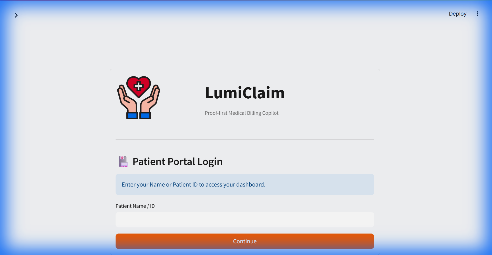
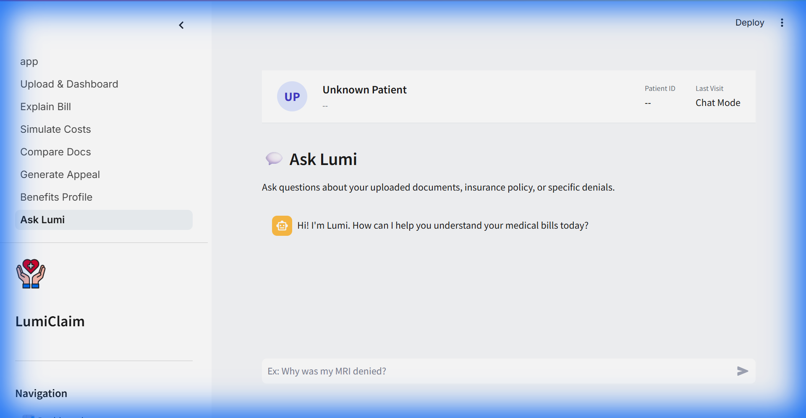

# 🏥 LumiClaim - AI-Powered Medical Billing Copilot

<p align="center">
  
</p>

**LumiClaim** is a proof-first medical billing copilot that helps patients understand, verify, and appeal their healthcare bills. Built with AI-powered document extraction, RAG-based Q&A, and intelligent cost simulation.

[](https://www.python.org/downloads/)
[](https://fastapi.tiangolo.com/)
[](https://streamlit.io/)

---

## 🎯 Problem Statement

Medical billing in the US is notoriously complex:
- **80%** of medical bills contain errors
- **$210 billion** is spent annually on claim denials
- Patients struggle to understand EOBs (Explanation of Benefits)
- Appeal processes are intimidating and time-consuming

**LumiClaim** solves this by providing an AI assistant that can read, explain, and help contest medical bills.

---

## ✨ Key Features

### 📄 Upload & Dashboard
Upload EOB documents (PDF, DOCX, PNG, JPG) and get instant structured extraction of:
- Procedure codes (CPT)
- Billed amounts, allowed amounts, patient responsibility
- Service dates and descriptions
- Insurance adjustments

### 💬 Ask Lumi (RAG-Powered Q&A)
<p align="center">
  
</p>

Ask natural language questions about your medical bills:
- *"Why was my MRI denied?"*
- *"What's my remaining deductible?"*
- *"Is this charge reasonable?"*

Powered by hybrid search (BM25 + vector embeddings) and LLM response generation.

### 📊 Explain Bill
Get plain-English explanations of complex medical charges:
- Adjustable reading level (6th grade → Professional)
- Persona-based explanations (Patient, Caregiver, Provider)
- Math breakdown of how your bill was calculated

### 💰 Simulate Costs
"What-if" analysis for different insurance scenarios:
- Compare actual charges vs. policy simulation
- Adjust deductible, coinsurance, out-of-pocket max
- See potential savings or billing discrepancies

### ⚖️ Generate Appeal
AI-generated appeal letters for denied claims:
- Professional formatting
- Medical necessity justification
- Export to PDF or DOCX

### 📋 Benefits Profile
Store and manage your insurance plan details:
- Deductible tracking (individual/family)
- Coinsurance percentage
- Out-of-pocket maximum with progress tracking
- Copay amounts for different visit types

---

## 🏗️ Architecture

LumiClaim uses a modern, modular architecture:

```
┌─────────────────────────────────────────────────────────────┐
│                    Frontend (Streamlit)                      │
│  Upload │ Explain │ Simulate │ Compare │ Appeal │ Ask Lumi  │
└────────────────────────┬────────────────────────────────────┘
                         │ HTTP/JSON
┌────────────────────────▼────────────────────────────────────┐
│                   Backend (FastAPI)                          │
│  ┌──────────┐  ┌──────────┐  ┌──────────┐  ┌──────────┐    │
│  │   RAG    │  │  Session │  │ Document │  │   LLM    │    │
│  │  Engine  │  │  Manager │  │ Extractor│  │ Adapters │    │
│  └────┬─────┘  └────┬─────┘  └────┬─────┘  └────┬─────┘    │
└───────┼─────────────┼─────────────┼─────────────┼───────────┘
        │             │             │             │
┌───────▼─────┐ ┌─────▼─────┐ ┌─────▼─────┐ ┌─────▼─────┐
│   Hybrid    │ │   JSON    │ │  pdfplumber│ │  Groq API │
│   Search    │ │   Files   │ │  python-docx│ │ Gemini API│
│ BM25+Vector │ │           │ │   Pillow   │ │           │
└─────────────┘ └───────────┘ └───────────┘ └───────────┘
```

For detailed architecture diagrams, see [docs/ARCHITECTURE.md](docs/ARCHITECTURE.md).

---

## 🛠️ Technology Stack

| Layer | Technologies |
|-------|-------------|
| **Frontend** | Streamlit, Python 3.11+ |
| **Backend** | FastAPI, Pydantic, CORS |
| **LLM** | Groq (Llama 3.2/3.3), Google Gemini 2.0 Flash |
| **Search** | BM25, Sentence Transformers (all-MiniLM-L6-v2) |
| **Document Processing** | pdfplumber, python-docx, Pillow, Tesseract OCR |
| **Data Storage** | JSON-based session storage |

---

## 🚀 Quick Start

### Prerequisites
- Python 3.11+
- Groq API key (free tier available at [console.groq.com](https://console.groq.com))

### Installation

```bash
# Clone the repository
git clone https://github.com/snigdhareddy482/LumiClaim.git
cd LumiClaim

# Create virtual environment
python -m venv .venv
source .venv/bin/activate  # Windows: .venv\Scripts\activate

# Install dependencies
pip install -r requirements.txt

# Set up environment variables
cp .env.example .env
# Edit .env and add your GROQ_API_KEY
```

### Running the Application

```bash
# Terminal 1: Start backend
cd backend
uvicorn main:app --host 0.0.0.0 --port 8000

# Terminal 2: Start frontend
cd frontend
streamlit run app.py
```

Open http://localhost:8501 in your browser.

---

## 📡 API Endpoints

| Endpoint | Method | Description |
|----------|--------|-------------|
| `/upload_eob` | POST | Upload EOB document for extraction |
| `/chat` | POST | RAG-powered Q&A about bills |
| `/explain/{doc_id}` | GET | Get bill explanation |
| `/simulate` | POST | Run cost simulation |
| `/appeal/pdf` | POST | Generate appeal letter PDF |
| `/profile/set` | POST | Save insurance profile |
| `/profile/get` | GET | Retrieve insurance profile |
| `/health` | GET | Health check |

---

## 🧪 Smoke Tests

Quick checks to verify the backend is working:

```bash
# 1. Backend health
curl http://localhost:8000/health

# 2. Explain sample document
curl http://localhost:8000/explain/EOB-001

# 3. Policy simulation
curl -X POST http://localhost:8000/simulate \
  -H "Content-Type: application/json" \
  -d '{"doc_id":"EOB-001","deductible_remaining":500,"coinsurance":0.2,"oop_remaining":1800}'

# 4. Generate appeal packet
curl -X POST http://localhost:8000/appeal \
  -H "Content-Type: application/json" \
  -d '{"doc_id":"EOB-001"}'
```

---

## 🔧 Configuration

### Environment Variables

| Variable | Description | Required |
|----------|-------------|----------|
| `GROQ_API_KEY` | Groq Cloud API key | Yes |
| `GEMINI_API_KEY` | Google Gemini API key | Optional |
| `USE_VERTEX` | Enable Vertex AI | Optional |
| `USE_ELASTIC` | Enable Elasticsearch | Optional |

### Profile Configuration

```bash
curl -X POST http://localhost:8000/profile/set \
  -H 'Content-Type: application/json' \
  -d '{
    "session_id": "session-123",
    "plan_name": "Acme PPO",
    "deductible_individual": 1500,
    "deductible_remaining": 500,
    "coinsurance": 0.2,
    "oop_max": 5000,
    "oop_remaining": 2000,
    "copays": {"primary": 20, "specialist": 40, "er": 200}
  }'
```

---

## 📁 Project Structure

```
LumiClaim/
├── backend/
│   ├── main.py              # FastAPI application
│   ├── rag.py               # RAG engine
│   ├── hybrid_local.py      # BM25 + vector search
│   ├── session.py           # Session management
│   ├── upload_eob.py        # Document upload handler
│   ├── extractors.py        # PDF/DOCX/Image extraction
│   ├── appeal.py            # Appeal generation
│   ├── exporter.py          # PDF/DOCX export
│   └── llm_adapters/
│       ├── groq_adapter.py  # Groq LLM integration
│       ├── gemini_adapter.py # Gemini integration
│       └── vertex_adapter.py # Vertex AI integration
├── frontend/
│   ├── app.py               # Streamlit main app
│   └── pages/
│       ├── 1_Upload_&_Dashboard.py
│       ├── 2_Explain_Bill.py
│       ├── 3_Simulate_Costs.py
│       ├── 4_Compare_Docs.py
│       ├── 5_Generate_Appeal.py
│       ├── 6_Benefits_Profile.py
│       └── 7_Ask_Lumi.py
├── data/
│   └── user_sessions/       # Per-user session data
├── docs/
│   ├── ARCHITECTURE.md      # Detailed architecture
│   └── screenshots/         # App screenshots
└── tests/                   # Test suite
```

---

## 🤝 Contributing

Contributions are welcome! Please feel free to submit a Pull Request.

---

## 📄 License

This project is licensed under the Apache 2.0 License - see the [LICENSE](LICENSE) file for details.

---

## 👨‍💻 Author

**Snigdha Reddy**
- GitHub: [@snigdhareddy482](https://github.com/snigdhareddy482)

---

<p align="center">
  <b>Made with ❤️ to help patients understand their medical bills</b>
</p>
