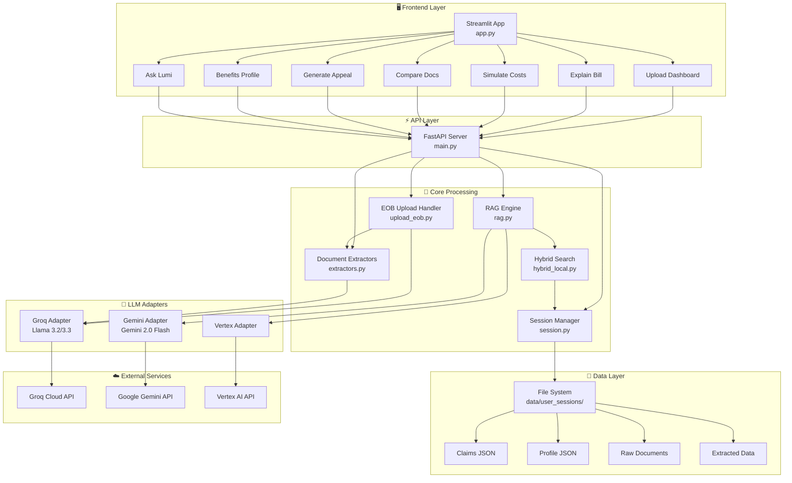
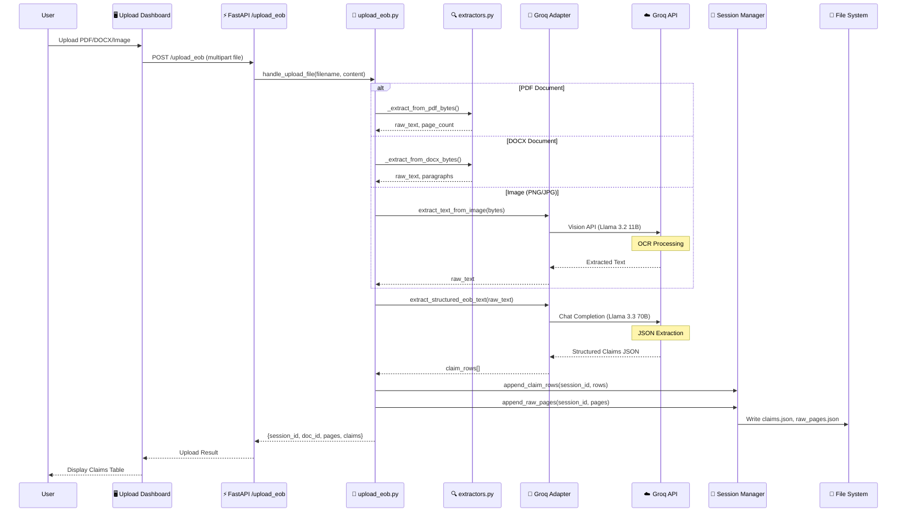
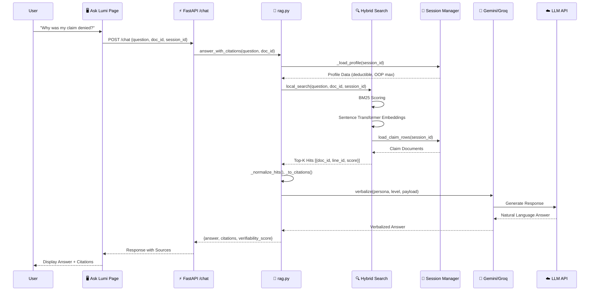
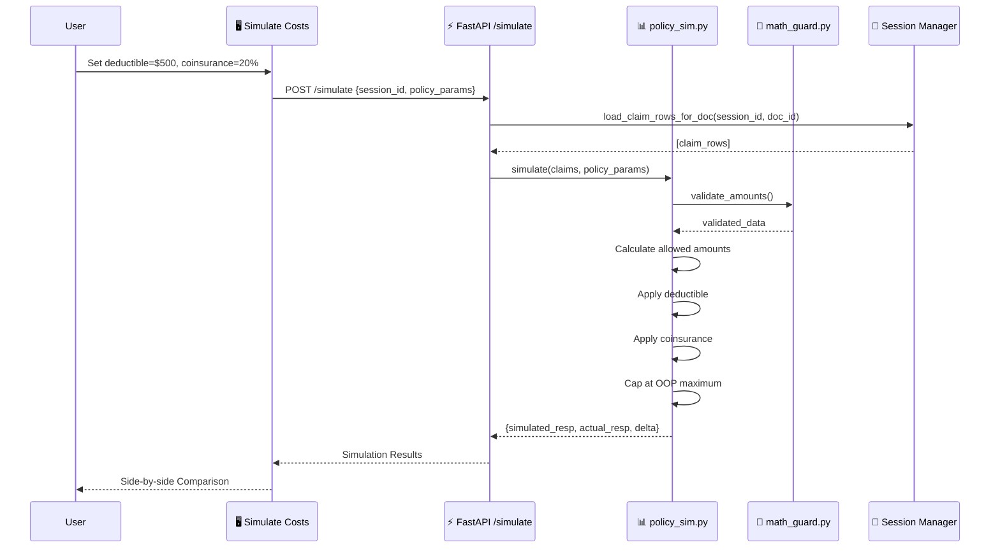
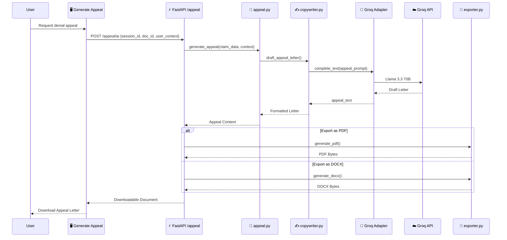
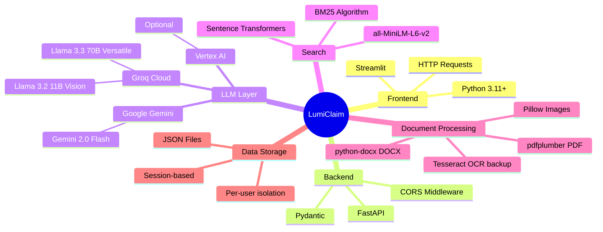

# LumiClaim Architecture Diagram

A comprehensive view of the LumiClaim Healthcare Prior Authorization & Claims Platform architecture, showing all tool connections and data flows.

---

## High-Level Architecture Overview

---

## Detailed Component Connections & Data Flows

### 1. Document Upload Flow

### 2. RAG Query Flow (Ask Lumi / Explain Bill)

### 3. Bill Simulation Flow

### 4. Appeal Generation Flow

---

## Component Data Exchange Summary

| Source Component | Target Component | Data Type | Description |
|-----------------|------------------|-----------|-------------|
| **Frontend** | FastAPI | HTTP Requests | JSON payloads, multipart files |
| **upload_eob.py** | Groq Adapter | Image bytes | For OCR processing |
| **upload_eob.py** | Groq Adapter | Raw text | For structured JSON extraction |
| **Groq Adapter** | Groq API | Base64 image + prompt | Vision model request |
| **Groq Adapter** | Groq API | Text prompt | Chat completion request |
| **Gemini Adapter** | Gemini API | Image + prompt | Vision extraction |
| **Gemini Adapter** | Gemini API | JSON payload | Verbalization request |
| **rag.py** | hybrid_local.py | Query string | Search request |
| **hybrid_local.py** | Session Manager | Session ID | Load claims data |
| **Session Manager** | File System | JSON data | Persist session state |
| **extractors.py** | upload_eob.py | Parsed rows, raw text | Document content |
| **RAG Engine** | LLM Adapters | Payload + citations | Generate response |

---

## Technology Stack Summary

---

## API Endpoints Reference

| Endpoint | Method | Purpose | Data In | Data Out |
|----------|--------|---------|---------|----------|
| `/upload_eob` | POST | Upload EOB document | Multipart file | session_id, doc_id, claims |
| `/chat` | POST | RAG Q&A | question, doc_id | answer, citations |
| `/explain/{doc_id}` | GET | Bill explanation | persona, level | breakdown, narrative |
| `/simulate` | POST | Cost simulation | policy_params | simulated vs actual |
| `/appeal/pdf` | POST | Generate appeal PDF | doc_id, context | PDF bytes |
| `/profile/set` | POST | Save user profile | profile_data | success status |
| `/profile/get` | GET | Get user profile | session_id | profile_data |
| `/session/start` | POST | Create session | optional session_id | session_id |
| `/sbc/parse` | POST | Parse SBC document | PDF file | plan attributes |

---

## Environment Variables

| Variable | Purpose | Used By |
|----------|---------|---------|
| `GROQ_API_KEY` | Groq Cloud authentication | groq_adapter.py |
| `GEMINI_API_KEY` | Google AI authentication | gemini_adapter.py |
| `USE_VERTEX` | Enable Vertex AI | config.py, rag.py |
| `USE_ELASTIC` | Enable Elasticsearch | config.py, rag.py |

---

## Key Data Flows Summary

1. **Document Upload → OCR → Structured Extraction → Storage**
   - Files go through format-specific extractors
   - Groq Vision handles image OCR
   - Groq LLM converts text to structured JSON claims
   - Session manager persists to file system

2. **User Query → Hybrid Search → RAG → LLM Response**
   - BM25 + vector embeddings find relevant claims
   - Context assembled with profile data
   - LLM generates natural language answer with citations

3. **Simulation → Policy Rules → Comparison**
   - User's policy parameters applied to actual claims
   - Mathematical calculation of expected vs actual responsibility
   - Delta analysis for potential savings/issues

4. **Appeal → AI Copywriting → Export**
   - Claim data assembled with denial context
   - LLM generates professional appeal letter
   - Exported as PDF or DOCX for submission
